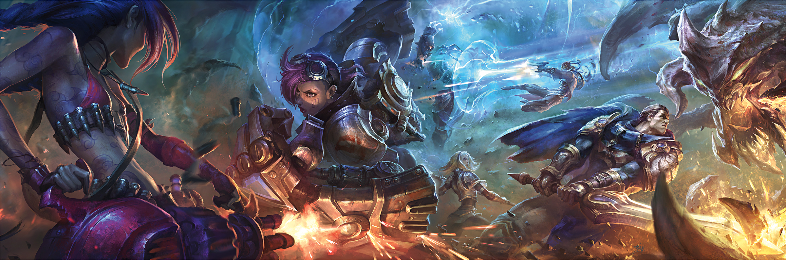

* DJT popularity likes twitter 




## Packages

```{r}
pacman::p_load(dplyr, ggplot2, rvest, purrr, xml2, stringr, anytime, magrittr, tidyr, tibble, devtools)
devtools::load_all()
```

## TODO

* **Bans appear to be the same by team!!!!**

## Basic Crawler

Test

```{r}
base_url <- "https://lol.gamepedia.com"
example_url <- paste0("https://lol.gamepedia.com/Special:RunQuery/MatchHistoryTournament?MHT%5Btournament%5D=Concept:", "MSI%202018", "%20Main%20Event&MHT%5Btext%5D=Yes&pfRunQueryFormName=MatchHistoryTournament")

example_html <- example_url %>% 
  xml2::read_html()

x <- example_html %>% 
  html_nodes(".wikitable") %>% 
  html_children() %>% 
  .[3:(length(.)-1)] %>% 
  .[25] # map index

## Match Data
get_match_data(x)%>% glimpse

## Player Stats
get_player_stats(x) %>% glimpse

## Compare to Oracleelex.
# load("data/match_stats.Rdata")
# match_stats %>% glimpse()
# 
# stats_names <- example_html %>% 
#   html_nodes(".wikitable") %>% 
#   html_children() %>% 
#   .[2] %>% 
#   html_text() %>% 
#   stringr::str_split("\\n+") %>% 
#   unlist() %>% 
#   stringr::str_trim()

## Match Stats
get_match_stats(x) %>% glimpse

## Meta Data
get_match_meta(x) %>% glimpse

## Map Over Games (get combined stats)
games_data <- example_html %>% 
  html_nodes(".wikitable") %>% 
  html_children() %>% 
  .[3:(length(.)-1)] %>% 
  map(get_match_details_safely) %>% 
  map("result") %>% 
  bind_rows()

games_data
```


## Map Tournaments

Get Tournament List

```{r}
seed_url <- "https://lol.gamepedia.com/Special:RunQuery/MatchHistoryTournament?MHT%5Btournament%5D=Concept:CK%202017%20Spring%20Playoffs&MHT%5Btext%5D=Yes&pfRunQueryFormName=MatchHistoryTournament"

tourn_table <- get_tournaments(seed_url)

#tourn_table$details[[1]]

tourn_table_long <- tourn_table %>% 
  tidyr::unnest()

tourn_table_long %>% glimpse()
```

```{r}
# tourn_table_long[1, ] %>% 
#   .$tourn_url %>% 
#   xml2::read_html() %>% 
#   get_tournament_matches %>% 
#   purrr::map("result") %>% 
#   dplyr::bind_rows()

tourn_matches <- tourn_table_long %>%
  #slice(55:60) %>%
  lolR::get_tourn_matches()

matches <- tourn_matches %>% 
  map("result") %>%
  bind_rows 

save(matches, file = "data/matches.Rdata")

matches %>% 
  count(game_id)

matches %>% glimpse()
```

```{r}
#go
```
